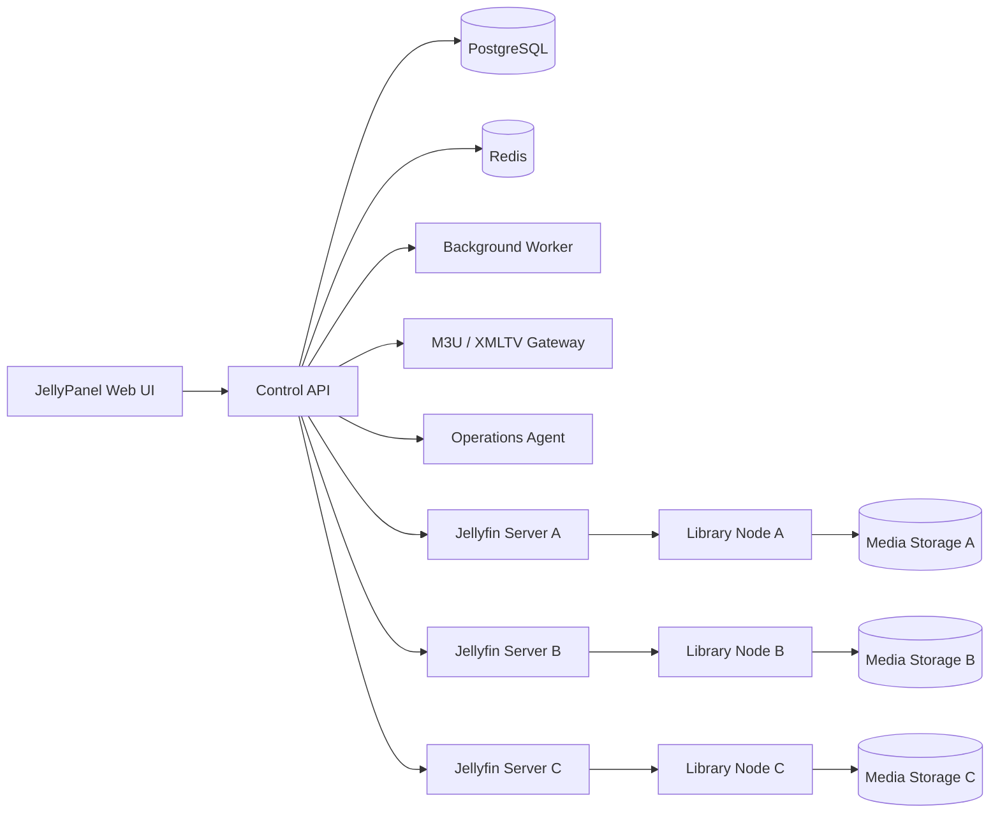

<div align="center">

# JellyPanel

### Standalone, multi-server Jellyfin management from one control plane

[](#installation)
[](#supported-environments)
[](#architecture)
[](#architecture)
[](#multi-server-control)
[](#current-status)

**Manage users, packages, resellers, libraries, Live TV, EPG, active streams, and multiple independent Jellyfin servers without installing Jellyfin on the panel host.**

</div>

---

## What is JellyPanel?

JellyPanel is a self-hosted operations platform for Jellyfin administrators, managed-hosting providers, organizations, hospitality systems, and advanced home-media operators.

It turns several independent Jellyfin servers into one manageable fleet while keeping each server's users, media paths, STRM libraries, M3U sources, XMLTV providers, health state, and playback sessions separate.

A fresh installation runs as a **standalone control plane**. It does not require a bundled Jellyfin server and does not proxy video traffic through the panel.

### Built for operators who need more than the standard server dashboard

- Manage several Jellyfin servers from one interface.
- Import and control existing Jellyfin users.
- Create or assign subscription-style packages.
- Delegate customer management to resellers.
- Apply expiration dates and simultaneous-stream limits.
- Deploy remote Library Nodes without manually building every server.
- Build independent STRM libraries for each server.
- Assign different M3U sources and categories to different Jellyfin servers.
- Configure server-specific M3U tuners and XMLTV guide providers.
- Monitor active streams, devices, IP addresses, and transcoding.
- Diagnose, back up, repair, and upgrade the platform from one place.

---

## Interface preview

<p align="center">
  
  
</p>

---

## Feature overview

| Area | Capabilities |
|---|---|
| **Multi-server control** | Register independent Jellyfin servers, encrypt API keys, choose a primary server, test API health, track versions and failures, and view combined fleet status. |
| **User lifecycle** | Import existing users, create and link accounts, enable, suspend, renew, expire, delete, synchronize policies, and reset passwords across assigned servers. |
| **Packages** | Connection limits, account duration, Live TV access, movie access, TV-show access, download permissions, and reseller credit cost. |
| **Resellers** | Administrator, master-reseller, reseller, sub-reseller, credit balances, credit history, customer ownership, and scoped visibility. |
| **Live TV and EPG** | Multiple M3U sources, category filtering, per-server source assignment, secured M3U/XMLTV feeds, tuner creation, guide providers, and guide refresh. |
| **Large playlists** | Background imports, job progress, duplicate-job protection, PostgreSQL bulk reconciliation, atomic replacement, and rollback to the last working playlist. |
| **STRM libraries** | Per-server media inventory, incremental STRM/NFO generation, existing-file adoption, duplicate protection, missing-file grace, and daily schedules. |
| **Remote deployment** | Install Library Nodes over SSH using Docker Compose or native Python/systemd. Password and private-key authentication are supported. |
| **Stream operations** | Active users, server, device, IP, media title, playback method, bitrate, direct play, direct stream, transcoding, messages, session stopping, and limit enforcement. |
| **Operations** | Fleet dashboard, CPU, memory, disk, network, server status, service health, controlled restarts, diagnostics, backups, restore, repair, upgrade, and rollback. |
| **Audit and safety** | Activity history, administrator protection, encrypted server credentials, redacted diagnostics, secured feed tokens, and optional automatic enforcement. |

---

## Why operators choose this model

### One panel, independent servers

Every registered Jellyfin server remains its own system. A failure or maintenance window on one server does not merge or overwrite another server's users, libraries, tuners, guide providers, or media paths.

### No central video proxy

JellyPanel controls Jellyfin through its API and publishes secured M3U/XMLTV feeds. Video playback stays between the Jellyfin server, its storage, and the client.

### Incremental automation

Large playlists and media libraries are processed as tracked jobs. Existing working data remains available until a successful replacement is ready.

### Reseller-ready account management

Packages, expirations, credits, ownership, and connection limits provide the foundation for a managed-service or customer-account workflow.

### Existing infrastructure stays in place

JellyPanel can be added to an existing Jellyfin environment. The control plane does not require media to be moved and does not require the panel host to run Jellyfin.

---

## Architecture



### Central services

- Web interface
- Control API
- Background worker
- PostgreSQL
- Redis
- Operations Agent
- Secured M3U/XMLTV gateway

### Services that stay on each media server

- Jellyfin Server
- Media storage or rclone mount
- Transcoding
- Optional Library Node
- Generated STRM/NFO library

---

## Product tour

### Fleet dashboard

See registered servers, API health, versions, active streams, panel health, CPU, memory, free storage, network totals, and Library Node status.

### Server registry

Add any existing Jellyfin server using its normal address and a dedicated API key. The first registered server becomes the primary account-management server.

### User management

Import existing accounts without changing their current passwords, assign packages, set expiration dates, synchronize policies, and link the same customer across several Jellyfin servers.

### Packages and resellers

Build reusable service plans with duration, connection limits, media access, and credit cost. Resellers can manage only the customers and balances assigned to them.

### Per-server libraries

Install a Library Node remotely, scan that server's local media, adopt existing STRM files, generate only missing or changed entries, and refresh only the affected Jellyfin library.

### Live TV and EPG

Assign specific M3U sources and categories to each Jellyfin server. JellyPanel creates secured server-specific playlist and XMLTV URLs, configures the tuner and guide providers, and triggers a guide refresh.

### EPG Mapper

Match channels through tvg-id, normalized names, channel numbers, confidence scoring, manual overrides, duplicate detection, and multiple XMLTV feed priorities.

### Stream Operations

View who is watching, where they connected from, which device they use, whether playback is direct or transcoded, and stop or message individual sessions.

### Operations Center

Review panel health, database and Redis status, server connectivity, storage, rclone responsiveness, active jobs, recent failures, backups, and diagnostics.

---

## Installation

### Fresh standalone installation

The recommended installation does **not** install Jellyfin on the panel host.

```bash
cd /root
sha256sum -c galaxytv-jellyfin-v1.4.4.zip.sha256
unzip -o galaxytv-jellyfin-v1.4.4.zip
cd galaxytv-jellyfin-v1.4.4
sudo bash install.sh --standalone-only
```

Open:

```text
http://PANEL_SERVER_IP:8181
```

Then select:

```text
Servers → Add server
```

### Optional local Jellyfin profile

For a lab, demonstration, or all-in-one installation:

```bash
sudo bash install.sh --with-local-jellyfin
```

The optional local Jellyfin container uses port `8097` by default.

### Upgrade from v1.4.3

```bash
cd /root
sha256sum -c galaxytv-jellyfin-v1.4.4.zip.sha256
unzip -o galaxytv-jellyfin-v1.4.4.zip
cd galaxytv-jellyfin-v1.4.4
sudo bash install.sh --mode upgrade
```

The upgrade preserves users, packages, resellers, credits, API keys, server assignments, M3U/XMLTV sources, EPG mappings, STRM inventory, backups, and audit history.

---

## Default ports

| Service | Default port | Exposure |
|---|---:|---|
| JellyPanel web interface | `8181` | Administrator access |
| Control API | `8182` | Localhost only |
| Secured M3U/XMLTV gateway | `8183` | Registered Jellyfin servers |
| Optional local Jellyfin | `8097` | Jellyfin clients |
| Remote Library Node | `8292` | Panel and local Jellyfin host |

Installation directory:

```text
/opt/galaxytv-jellyfin
```

---

## Supported environments

### Panel host

- **Recommended:** Ubuntu 24.04 LTS
- Docker Engine and Docker Compose are installed automatically when needed.
- A clean VPS or virtual machine is recommended for production testing.

### Managed Jellyfin servers

Jellyfin servers can run separately from the panel and only need to be reachable through the Jellyfin API.

Remote Library Node installation is designed for Ubuntu and Debian hosts using either:

- Docker Compose
- Python virtual environment and systemd

Older Ubuntu media servers may be managed through the Jellyfin API. The central panel host remains recommended on Ubuntu 24.04, and native Library Node deployment on older distributions should be tested before production use.

### Storage

Media can remain on:

- Local disks
- NFS or SMB mounts
- rclone mounts
- Google Drive or other cloud-backed mounts
- Existing STRM libraries

The Library Node must be able to read the server's configured source path and write to its configured STRM output path.

---

## Recommended starting resources

For a small deployment managing several Jellyfin servers:

| Resource | Recommended starting point |
|---|---:|
| CPU | 4 vCPU |
| Memory | 8 GB RAM |
| Storage | 100–160 GB NVMe |
| Network | 1 Gbps |
| OS | Ubuntu 24.04 LTS |

The panel does not transcode or proxy video, so media bandwidth and transcoding resources remain on the Jellyfin servers.

---

## Remote Library Nodes

Install from the panel under:

```text
Libraries → Install node
```

Supported deployment modes:

- Docker Compose
- Native Python and systemd
- SSH password authentication
- OpenSSH private keys
- Encrypted keys with passphrases
- Root or passwordless-sudo deployment
- Optional SSH host-key verification

SSH credentials are used only during the active deployment and are not saved in PostgreSQL.

Each server receives its own:

- Source media path
- STRM output path
- Agent token
- Media token
- Daily scan time
- Missing-file grace period
- Existing STRM adoption state
- Jellyfin library refresh configuration

---

## Large M3U and XMLTV workflows

M3U imports run as background jobs rather than blocking the panel.

JellyPanel uses bulk PostgreSQL reconciliation so large playlists can be replaced atomically. The previous working playlist stays active until the new import completes successfully.

Each registered Jellyfin server receives a signed feed URL containing only the sources and categories assigned to that server.

Monitor imports with:

```bash
watch -n 2 \
  sudo /opt/galaxytv-jellyfin/scripts/manage.sh m3u-jobs
```

---

## Useful management commands

```bash
sudo /opt/galaxytv-jellyfin/scripts/manage.sh health
sudo /opt/galaxytv-jellyfin/scripts/manage.sh servers
sudo /opt/galaxytv-jellyfin/scripts/manage.sh libraries
sudo /opt/galaxytv-jellyfin/scripts/manage.sh deployments
sudo /opt/galaxytv-jellyfin/scripts/manage.sh m3u-jobs
sudo /opt/galaxytv-jellyfin/scripts/manage.sh diagnostics
```

View the generated panel administrator credentials:

```bash
sudo cat /opt/galaxytv-jellyfin/panel-admin-credentials.txt
```

---

## Security model

- Remote Jellyfin API keys are encrypted before database storage.
- Server-specific M3U/XMLTV URLs use signed feed tokens.
- Control API and database ports are not intended for public exposure.
- Diagnostic packages redact passwords, API keys, and secrets.
- SSH passwords, private keys, passphrases, and sudo passwords are not retained after a node deployment.
- Administrator accounts are protected from reseller actions.
- Existing imported Jellyfin passwords are never read or exposed.
- HTTPS or a trusted private network is strongly recommended.
- Never expose the Docker socket, PostgreSQL, Redis, or internal control ports directly to the internet.

See [`SECURITY.md`](SECURITY.md) for deployment guidance.

---

## Current status

JellyPanel v1.4.4 is an **early-access self-hosted release**.

The package has passed validation for:

- Python and shell syntax
- Docker Compose and YAML
- Browser JavaScript and HTML references
- Database migrations through schema 19
- Standalone control-plane installation
- Multi-server user assignment
- Remote Library Node deployment logic
- Per-server STRM library synchronization
- Per-server Live TV tuner and XMLTV configuration
- Large-playlist background imports
- A generated 20,000-channel M3U test
- ZIP integrity and internal SHA-256 manifests

Real-world testing should be completed on a staging installation before placing the panel into production.

---

## Commercial and managed-service use

JellyPanel is designed to provide the technical foundation for managed Jellyfin hosting, customer-account administration, reseller workflows, hospitality systems, community media systems, and private organizational deployments.

Before selling a service, operators should provide their own:

- Hosting and support terms
- Privacy policy
- Billing system
- Customer authentication policy
- Backup and retention policy
- Incident-response process
- Content rights and distribution permissions

JellyPanel does not include billing, payment processing, media, television channels, subscription services, or content licenses.

---

## Disclaimer

JellyPanel is an independent project and is not affiliated with, endorsed by, or sponsored by the Jellyfin project.

Jellyfin and related marks belong to their respective owners. No media, television service, subscription service, or copyrighted content is included. Use only media and sources you own or are authorized to manage and distribute.

---

<div align="center">

**One control plane. Multiple Jellyfin servers. Independent libraries, users, Live TV, and operations.**

</div>
