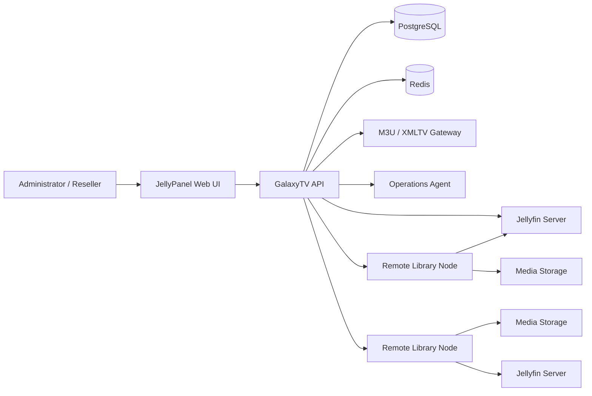

<div align="center">

# GalaxyTV JellyPanel

### Jellyfin Management Suite v1.3.0

[](./galaxytv-jellyfin-v1.3.0.zip)


**One panel for Jellyfin users, packages, resellers, Live TV, EPG, distributed libraries, stream monitoring, backups, and server operations.**

[Download v1.3.0](./galaxytv-jellyfin-v1.3.0.zip) · [What’s new](#whats-new-in-v130) · [Installation](#installation) · [Remote Library Nodes](#remote-library-nodes)

</div>

## Screenshots

<table>
  <tr>
    <td width="50%" align="center">
      
      <br /><strong>Dashboard and system overview</strong>
    </td>
    <td width="50%" align="center">
      
      <br /><strong>Management workspace</strong>
    </td>
  </tr>
</table>

## Overview

GalaxyTV JellyPanel turns a standard Jellyfin installation into a managed media platform. It combines customer and reseller management with Live TV tools, XMLTV/EPG automation, distributed STRM libraries, real-time playback monitoring, health checks, backups, diagnostics, and controlled server operations.

The suite is designed for operators managing media they own or are authorized to distribute. No media, television service, provider credentials, or copyrighted content is included.

## What’s new in v1.3.0

Version 1.3.0 adds remote Library Node deployment directly from **Server Libraries → Install Node**.

- Install or update a Library Node over SSH from JellyPanel.
- Choose Docker Compose or native Python/systemd deployment.
- Optionally install Docker Engine when it is missing.
- Authenticate with an SSH password or OpenSSH private key.
- Support root, passwordless sudo, or sudo-password elevation.
- Optional strict SSH host-key verification.
- Generate unique Agent and Media tokens for every node.
- Save node URLs, tokens, source paths, output paths, and readiness automatically.
- Review live deployment progress and the final installation log.
- Preserve existing STRM files, SQLite inventory, state, and missing-file history during updates.
- Keep SSH passwords, private keys, passphrases, and sudo passwords out of PostgreSQL.
- Retain manual Docker and native installers for offline or restricted environments.
- Database schema upgraded to **17**.

## Feature matrix

| Area | Included capabilities |
|---|---|
| **Installation and lifecycle** | Guided Ubuntu 24.04 installation, Docker setup, configurable ports and paths, fresh install, upgrade, repair, restore, diagnostics, uninstall, pre-upgrade backup, validation, and rollback. |
| **Jellyfin users** | Create, edit, renew, suspend, re-enable, reset passwords, remove users, enforce expiration dates, disable downloads, protect administrator accounts, and apply package policies. |
| **Packages** | Duration, simultaneous connection limits, movies, TV shows, Live TV, downloads, reseller credit cost, and retail price. |
| **Resellers** | Administrator, master-reseller, and reseller roles; customer ownership; child resellers; credit balances; transaction history; and activity records. |
| **Multiple servers** | Register and test multiple Jellyfin servers, assign users and libraries, review server health, and manage remote Library Nodes. |
| **M3U and Live TV** | Multiple playlists, source enable/disable, category filters, customer-specific playlists, logo/group/tvg-id preservation, source testing, and Jellyfin refresh controls. |
| **XMLTV and EPG** | Multiple feeds, priorities, embedded URL detection, exact and normalized matching, channel-number matching, confidence scoring, duplicate detection, manual overrides, and preview before applying. |
| **Library mirror** | Movies and TV episodes, TMDB metadata, STRM files, Jellyfin-compatible NFO files, posters, backdrops, stable playback links, incremental updates, and missing-file grace periods. |
| **Remote Library Nodes** | Panel-driven SSH deployment, Docker or native mode, per-node tokens, live logs, update preservation, existing-library adoption, verification, and scheduled synchronization. |
| **Stream Operations** | Active user, reseller, IP, device, client, title/channel, progress, paused state, Direct Play/Direct Stream/transcoding, codecs, resolution, bitrate, and connection usage. |
| **Playback controls** | Send an on-screen message, stop an individual session, suspend or re-enable a user, and optionally enforce excess-session limits. |
| **Abuse monitoring** | Connection-limit warnings, multiple-IP detection, reconnect patterns, session history, reseller-scoped warnings, and optional automatic enforcement. |
| **Operations Center** | Jellyfin, PostgreSQL, Redis, API, workers, gateways, rclone, disk space, active sessions, inventory, mirror jobs, metadata failures, and controlled restarts. |
| **Backup and recovery** | Manual and nightly backups, daily/weekly retention, PostgreSQL, Jellyfin configuration, panel data, M3U/XMLTV, EPG mappings, optional mirror data, checksums, restore, and rollback. |
| **Diagnostics** | One-click redacted support ZIP with container health, logs, mount information, disks, migrations, M3U/EPG status, mirror jobs, and session status. |

## Architecture



## Installation

### Requirements

- Ubuntu 24.04 is the primary supported host operating system.
- Root or sudo access.
- Internet access during initial installation.
- Sufficient storage for Jellyfin configuration, PostgreSQL, Redis, backups, logs, and generated library metadata.
- Media mounts must be available before enabling automated library synchronization.

### Fresh installation

Download and extract the current package:

```bash
cd /root
unzip -o galaxytv-jellyfin-v1.3.0.zip
cd galaxytv-jellyfin-v1.3.0
sudo bash install.sh
```

The installer supports configurable panel, Jellyfin, and internal-service ports so JellyPanel can coexist with Emby, Plex, or another Jellyfin installation.

### Upgrade from v1.2.0

```bash
cd /root
unzip -o galaxytv-jellyfin-v1.3.0.zip
cd galaxytv-jellyfin-v1.3.0
sudo bash install.sh --mode upgrade
```

The upgrade preserves Jellyfin, PostgreSQL, Redis, users, servers, packages, resellers, credits, M3U/XMLTV sources, EPG mappings, backups, STRM files, and Library Agent inventory. A normal pre-upgrade backup is created, and application files roll back automatically when validation fails.

After upgrading:

```bash
sudo /opt/galaxytv-jellyfin/scripts/manage.sh health
sudo /opt/galaxytv-jellyfin/scripts/manage.sh deployments
```

Force-refresh the browser with `Ctrl+F5` after the upgrade.

## Remote Library Nodes

Remote nodes let one central JellyPanel manage STRM/NFO libraries generated close to the media storage.

### Panel-driven installation

1. Register and test the remote Jellyfin server under **Servers**.
2. Open **Server Libraries → Install Node**.
3. Enter the SSH host, port, username, and authentication method.
4. Select Docker Compose or native Python/systemd deployment.
5. Set the host media scan path and STRM output path.
6. Set the Agent URL and Jellyfin URL reachable from the node.
7. Review the live deployment log and confirm the node reports ready.

The deployment request keeps temporary SSH credentials only in memory. Credentials are discarded when the job ends, and the remote temporary installation directory is removed after a successful deployment.

### Docker node layout

```text
/opt/galaxytv-library-node/
├── .env
├── compose.yml
├── library-agent/
├── state/
└── strm-library/
```

Recommended Jellyfin URL from a Docker node:

```text
http://host.docker.internal:8096
```

Mount the generated library into the remote Jellyfin container:

```yaml
volumes:
  - /opt/galaxytv-library-node/strm-library:/strm-library:ro
```

Then add these Jellyfin libraries after the first successful synchronization:

```text
Movies:   /strm-library/Movies
TV Shows: /strm-library/TV Shows
```

### Native node layout

```text
/etc/systemd/system/galaxytv-library-node.service
/etc/galaxytv-library-node.env
/opt/galaxytv-library-node/library-agent
/opt/galaxytv-library-node/venv
/opt/galaxytv-library-node/state
```

Recommended Jellyfin URL from a native node:

```text
http://127.0.0.1:8096
```

The service defaults to root to avoid media-mount permission failures. A restricted account can be used when it has read access to the media source and write access to the STRM output path.

### Safe adoption workflow

Remote installation does not automatically synchronize a full media library.

1. Test the node.
2. Review source and output paths.
3. Use **Adopt Existing** when older STRM files already exist.
4. Run **Verify**.
5. Run a small test synchronization.
6. Add the generated library paths to Jellyfin.
7. Keep the previous direct-media library enabled until playback and metadata are confirmed.

An unavailable or empty mount cannot trigger mass deletion. Missing generated items retain the configured grace period.

## Management commands

```bash
sudo /opt/galaxytv-jellyfin/scripts/manage.sh health
sudo /opt/galaxytv-jellyfin/scripts/manage.sh status
sudo /opt/galaxytv-jellyfin/scripts/manage.sh servers
sudo /opt/galaxytv-jellyfin/scripts/manage.sh libraries
sudo /opt/galaxytv-jellyfin/scripts/manage.sh deployments
sudo /opt/galaxytv-jellyfin/scripts/manage.sh logs
```

## Security design

- Administrative Jellyfin accounts are protected from reseller actions.
- Customer downloads are disabled by default unless a package permits them.
- API keys and passwords are redacted from diagnostics.
- SSH passwords, private keys, passphrases, and sudo passwords are not stored in PostgreSQL.
- Each Library Node receives separate Agent and Media tokens.
- Strict SSH host-key verification is available for production deployments.
- Internal agent ports should be restricted with a firewall, private LAN, or WireGuard.
- The plain HTTP Library Agent should not be exposed directly to the public internet.
- Automatic excess-session enforcement is optional and disabled by default.

## Current limitations

- Automatic remote deployment currently targets apt-based Ubuntu and Debian hosts.
- Remote deployment requires administrator-approved root or sudo access.
- JellyPanel does not automatically modify a remote firewall.
- JellyPanel does not automatically modify remote Jellyfin container volume mappings.
- A deployment interrupted by a central API restart is marked failed because SSH credentials are intentionally not retained.
- Test one server and a small media folder before enabling scheduled synchronization for a large library.

## Intended use

GalaxyTV JellyPanel is suitable for personal media servers, private organizations, hospitality systems, educational or community libraries, managed Jellyfin hosting, and reseller-based customer management.

Use it only with content and sources you own or are authorized to distribute.

<div align="center">

### One ZIP. One installer. One management panel.

</div>
